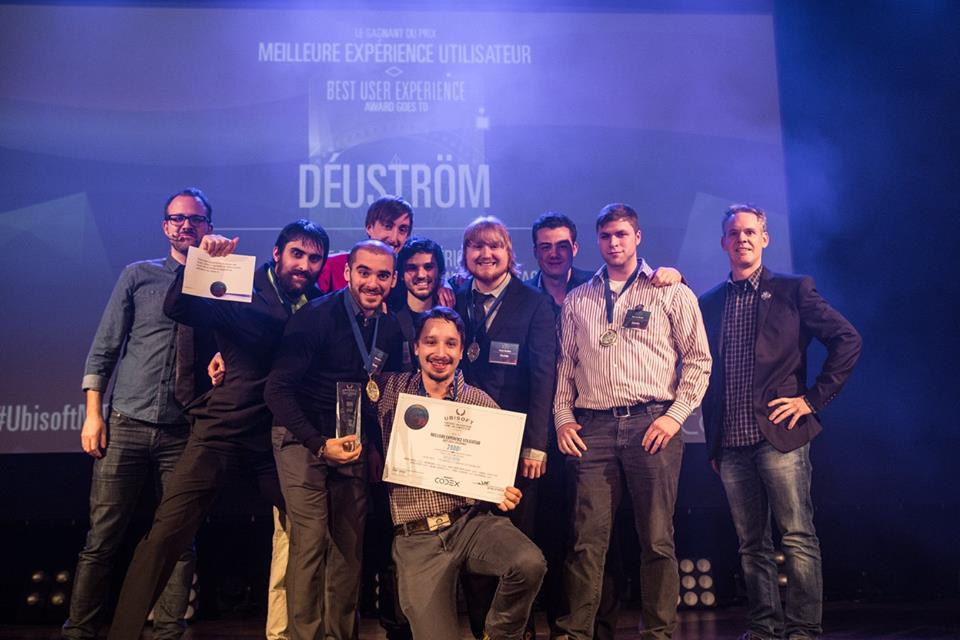

I am a gameplay-programmer currently living in Quebec, Canada.  I have a bachelor's degree in computer science at UQAC (Université du Québec à Chicoutimi).  

So far, I worked a lot with C/C++, C#, Java and JavaScript.  I have also finished multiple projects on both Unity and Unreal Engine 4.  

Recently, I participated at the university Game Lab 2016 competition hosted by Ubisoft Montreal. Me and my team placed first in Best User Experience and was nominated in Best Prototype and Best 3C's for our prototype Déuström.

 

Obviously, I'm an avid gamer.  I've spent countless hours on the popular ARTS DOTA 2 and I'm a fan of tactical fps games (rainbow six, arma, red orchestra, etc).  I love RPGs and I'm good at Dance Dance Revolution (no joke).
I'm currently looking for a job in the video game industry.  If you wish to contact me just send me an email at <a href="mailto:marcfl20@gmail.com?Subject=HelloMarc" target="_top">marcfl20@gmail.com</a> .
